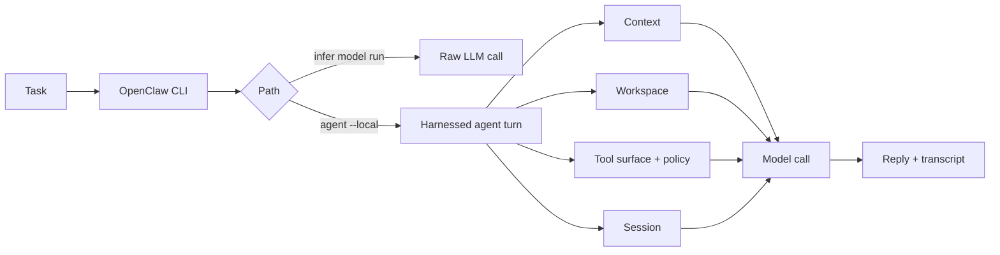

---
layout:
  width: wide
  title:
    visible: true
  description:
    visible: true
  tableOfContents:
    visible: true
  outline:
    visible: true
  pagination:
    visible: true
  metadata:
    visible: true
  tags:
    visible: true
  actions:
    visible: true
---

# Overall Harness

This lab shows what changes when an LLM is placed inside an agent harness.

A raw LLM call sends explicit input to a model and receives text. A harnessed agent turn surrounds the model with a runtime: prompt context, workspace access, tool surface, policy, session state, and observable output. The point is not that the model becomes more powerful. The point is that the system decides what the model can see, what it can ask the runtime to do, and how the turn is recorded and improved.

In this chapter, **Harness Engineering** means the system practice around agents: designing context, action boundaries, workflow/session control, observability, and feedback loops so an agent behaves reliably. OpenClaw gives us a real system where these surfaces are visible.

## What To Learn

By the end of this lab, you should be able to explain:

* why a working model route is not the same as a working agent;
* which inputs and controls surround an OpenClaw agent turn;
* how workspace, tool policy, and session state appear in observable output;
* how to map a changed behavior to the harness surface you would inspect first.

## Mental Model



`infer model run` is the narrow path. It checks the selected model route and auth on the prompt you pass. It does not start a chat-agent turn, load tools, include prior session transcript, or assemble workspace/bootstrap context.

`agent --local` is the harnessed path. OpenClaw prepares an agent turn, selects the runtime, assembles prompt context, exposes a tool surface, applies policy, mediates workspace access, and persists the transcript.

OpenClaw documentation also uses **agent harness** as a narrower implementation term: the low-level component behind an agent runtime. This course uses the broader Harness Engineering sense, and OpenClaw's runtime/harness is one concrete place where those ideas show up.

## Terms

| Term | What it means in this lab |
| --- | --- |
| Model route | The configured access path to a model. DeepSeek is a hosted API example; Ollama is a local model server example; vLLM/SGLang can be self-hosted backend examples if configured. |
| Raw LLM call | A one-shot call through `openclaw infer model run`. It receives only the prompt and explicit inputs passed to that command. |
| Harnessed agent turn | A turn run through `openclaw agent --local`, where OpenClaw prepares context, workspace access, tools, policy, and session state. |
| Context surface | The prompt package assembled for the model: instructions, user message, session history, tool schemas, and workspace-derived content. |
| Workspace surface | Files the runtime can make available to the agent turn. In this lab, `AGENTS.md`, `SOUL.md`, `USER.md`, and `notes.txt` are controlled workspace fixtures. |
| Action boundary | The line between model text and runtime-mediated actions. The model does not directly own files, tools, session history, or side effects. |
| Policy surface | Concrete controls such as tool policy, sandboxing, permissions, and context budget. This lab previews them; Guardrails studies them directly. |
| Session surface | The transcript/history selected by `--session-key`. A fresh key helps isolate observations from stale history. |
| Observability surface | The command output, diagnostics, file contents, and transcripts you inspect to understand what happened. |

## Observation Path

The notebook does not try to prove the whole harness with one artificial test. Instead, it makes several harness surfaces visible with small observations.

| Observation | What students should notice | Harness surface |
| --- | --- | --- |
| Raw LLM smoke probe returns the requested token, or a close-but-not-exact token on a small local model | The selected model route and auth work on a small prompt. Exact instruction following is a separate model-quality signal. | Model route |
| Raw infer asks about `notes.txt` but the marker is not in the prompt | The model only receives explicit input; it was not given the file content. | Context surface |
| The notebook prints workspace files before copying/running | Workspace artifacts are concrete files, not vague prompt magic. | Workspace surface / observability |
| DeepSeek full agent turn asks to read `notes.txt` and returns the marker | The runtime can mediate workspace access in the harnessed agent turn. | Workspace surface / action boundary |
| Ollama full agent turn returns the marker, misses it, emits tool-like text, or becomes slow | The same harness workload can expose model, context, and runtime-capacity limits under a small local backend. | Model route / context budget / runtime capacity |
| Output includes `[agents/tool-policy] tool policy removed...` | The action space is shaped by runtime policy before the model acts. | Policy surface / action boundary |
| A fresh `--session-key` changes what history is available | The turn is isolated from stale transcript state. | Session surface |

The `notes.txt` marker is only a controlled fixture:

```text
Workspace marker: HARNESS_CONTEXT_VISIBLE
```

It is not a test of whether the model can magically inspect files. If you paste the marker directly into a raw prompt, the model can repeat it. If you do not pass the file content, the raw LLM call should not know it. In the harnessed turn, the runtime may make the workspace content available through the agent workflow.

The teaching point is: **the harness controls input construction and action mediation**.

## Open The Notebook

Open the runnable notebook:

[Open in Colab](https://colab.research.google.com/github/SleepyLGod/openclaw-teaching/blob/main/labs/overall-harness/openclaw_overall_harness.ipynb)

DeepSeek and Ollama are observation paths, not mandatory requirements. DeepSeek needs a student-owned API key and may cost money. Ollama needs enough Colab or local compute for the chosen model. The notebook gives the operational details near each lane.

**Tip:** You can replace the model route. DeepSeek is only the default hosted API example. If you have another configured API provider, you can use that instead. The Ollama lane is also not tied to `llama3.2:3b`; choose a model your runtime can handle. A local or self-hosted backend such as vLLM or SGLang can also be used if it is exposed through an OpenAI-compatible or otherwise configured OpenClaw route.

A few runtime tips: if DeepSeek asks for a key, skip that lane unless you have one. If Ollama cannot connect, restart the Ollama setup cell. If you use a Colab T4, a quantized 7B or 8B Ollama model is a reasonable next experiment after `llama3.2:3b`; a 14B model may fit only with tighter memory and slower full-agent behavior. If Ollama passes the smoke probe but stalls or gives off-task output in the full agent turn, record that as a workload observation rather than a broken lab.

## Observation -> Harness Surface

Use this table after running or reading the notebook output.

| If you observe... | First place to look |
| --- | --- |
| API auth or model listing fails | Model route |
| Raw LLM call gives a different answer than expected | Prompt text / explicit input |
| Full agent turn ignores `AGENTS.md` or `SOUL.md` | Context surface / workspace setup |
| Agent cannot use or see a tool | Tool surface / policy surface |
| Tool-policy diagnostic removes tools | Policy surface |
| Old behavior appears after you changed files | Session surface / stale transcript |
| Ollama smoke output is close but not exact | Model route works; instruction following is weak |
| Local model is slow, misses the marker, or produces tool-like output | Model route / context budget / runtime capacity |
| You cannot tell what happened | Observability surface |

This is the habit behind Harness Engineering: when behavior changes, identify which surface to inspect or improve. Do not jump straight to “the model is bad” or “try again.”

## Colab Runtime Safety

Each user gets their own Colab runtime when opening the notebook link. Your API key, `/content`, Ollama process, and `~/.openclaw` config are not shared through GitBook or GitHub.

If you use the same Google account in multiple browsers, Colab may reconnect to your own active runtime. Before sharing screenshots or committing notebook changes, clear outputs and avoid printing secrets.

For a clean environment, use one of these Colab actions:

```text
Runtime -> Disconnect and delete runtime
Runtime -> Factory reset runtime
```

## Discussion Questions

1. Which command was only a raw LLM call?
2. Which command ran a harnessed agent turn?
3. What exact input did the raw LLM call receive?
4. Which workspace files shaped the full agent response?
5. What did the tool-policy line show about the action boundary?
6. Why can a model smoke probe pass while `agent --local` is slow or unstable?
7. Which observation maps to context, workspace, policy, session, or model route?
8. Which surfaces should be saved for deeper Guardrails, Eval, Multi-Agent, or Skills chapters?

## Key Takeaway

An LLM call returns text from explicit input. A harnessed agent turn runs inside a system boundary.

Harness Engineering is the practice of shaping that boundary: what the model sees, what actions are mediated, how workflow state is tracked, how behavior is observed, and where the system should be improved when behavior changes.

## References

* [OpenAI Harness Engineering](https://openai.com/index/harness-engineering/)
* [Martin Fowler: Harness engineering for coding agent users](https://martinfowler.com/articles/exploring-gen-ai/harness-engineering.html)
* [OpenClaw Agent Runtimes](https://docs.openclaw.ai/concepts/agent-runtimes)
* [OpenClaw Agent Harness Plugins](https://docs.openclaw.ai/plugins/sdk-agent-harness)
* [OpenClaw Agent Loop](https://docs.openclaw.ai/concepts/agent-loop)
* [OpenClaw Context](https://docs.openclaw.ai/context/)
* [OpenClaw Agent CLI](https://docs.openclaw.ai/cli/agent)
* [OpenClaw Infer CLI](https://docs.openclaw.ai/cli/infer)
* [OpenClaw Models CLI](https://docs.openclaw.ai/cli/models)
* [OpenClaw Provider Plugins](https://docs.openclaw.ai/plugins/sdk-provider-plugins)
* [OpenClaw DeepSeek Provider](https://docs.openclaw.ai/providers/deepseek)
* [OpenClaw Ollama Provider](https://docs.openclaw.ai/providers/ollama)
* [OpenClaw Docker](https://docs.openclaw.ai/install/docker)
* [Ollama Library](https://ollama.com/library)
* [Ollama qwen2.5-coder](https://ollama.com/library/qwen2.5-coder)
* [Ollama Llama 3.1](https://ollama.com/library/llama3.1)
* [vLLM OpenAI-Compatible Server](https://docs.vllm.ai/serving/openai_compatible_server.html)
* [SGLang OpenAI-Compatible API](https://sgl-project-sglang-93.mintlify.app/backend/openai-compatible-api)
* [Google Colab FAQ](https://research.google.com/colaboratory/faq.html)
* [GitBook Mermaid Troubleshooting](https://gitbook.com/docs/help-center/integrations/existing-integrations/why-is-the-mermaid-block-not-loading)
