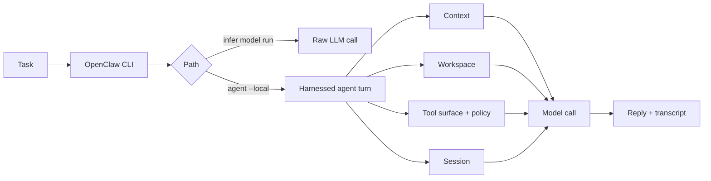

---
layout:
  width: wide
  title:
    visible: true
  description:
    visible: true
  tableOfContents:
    visible: true
  outline:
    visible: true
  pagination:
    visible: true
  metadata:
    visible: true
  tags:
    visible: true
  actions:
    visible: true
---

# Overall Harness

This chapter shows why a raw LLM call is not the same as an agent turn.

A raw LLM call sends explicit input to a model and receives text. A harnessed agent turn surrounds the model with a runtime: prompt context, workspace access, tool surface, policy, session state, and observable output. The point is not that the model becomes more powerful. The point is that the system decides what the model can see, what it can ask the runtime to do, and how the turn is recorded and improved.

In this chapter, **Harness Engineering** means the system practice around agents: designing context, action boundaries, workflow/session control, observability, and feedback loops so an agent behaves reliably. OpenClaw gives us a real system where these surfaces are visible.

## What To Learn

By the end of this chapter, you should be able to explain:

* why a working model route is not the same as a working agent;
* which inputs and controls surround an OpenClaw agent turn;
* how workspace, tool policy, and session state appear in observable output;
* how to map a changed behavior to the harness surface you would inspect first.

## Mental Model

`infer model run` is the narrow path. It checks the selected model route and auth on the prompt you pass. It does not start a chat-agent turn, load tools, include prior session transcript, or assemble workspace/bootstrap context.

`agent --local` is the harnessed path. OpenClaw prepares an agent turn, selects the runtime, assembles prompt context, exposes a tool surface, applies policy, mediates workspace access, and persists the transcript.

OpenClaw documentation also uses **agent harness** as a narrower implementation term: the low-level component behind an agent runtime. This course uses the broader Harness Engineering sense, and OpenClaw's runtime/harness is one concrete place where those ideas show up.

## Chapter Path

1. Read this overview to anchor the vocabulary and system boundary.
2. Start with [Overall Harness Lab](overall-harness-lab.md) for the runnable A/B/C observation path.
3. Use [OpenClaw Harness Source](openclaw-harness-source.md) later when we inspect OpenClaw internals.

Open the runnable notebook directly:

[Open in Colab](https://colab.research.google.com/github/SleepyLGod/openclaw-teaching/blob/main/labs/overall-harness/openclaw_overall_harness.ipynb)

## Key Terms

| Term | What it means in this chapter |
| --- | --- |
| Model route | The configured access path to a model. DeepSeek is a hosted API example; Ollama is a local model server example; vLLM/SGLang can be self-hosted backend examples if configured. |
| Raw LLM call | A one-shot call through `openclaw infer model run`. It receives only the prompt and explicit inputs passed to that command. |
| Harnessed agent turn | A turn run through `openclaw agent --local`, where OpenClaw prepares context, workspace access, tools, policy, and session state. |
| Context surface | The prompt package assembled for the model: instructions, user message, session history, tool schemas, and workspace-derived content. |
| Action boundary | The line between model text and runtime-mediated actions. The model does not directly own files, tools, session history, or side effects. |
| Session surface | The transcript/history selected by `--session-key`. A fresh key helps isolate observations from stale history. |

## Key Takeaway

An LLM call returns text from explicit input. A harnessed agent turn runs inside a system boundary.

Harness Engineering is the practice of shaping that boundary: what the model sees, what actions are mediated, how workflow state is tracked, how behavior is observed, and where the system should be improved when behavior changes.
